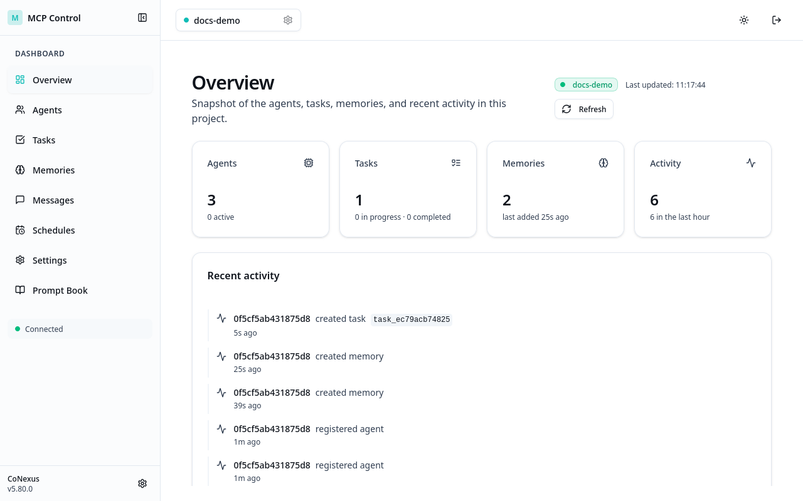
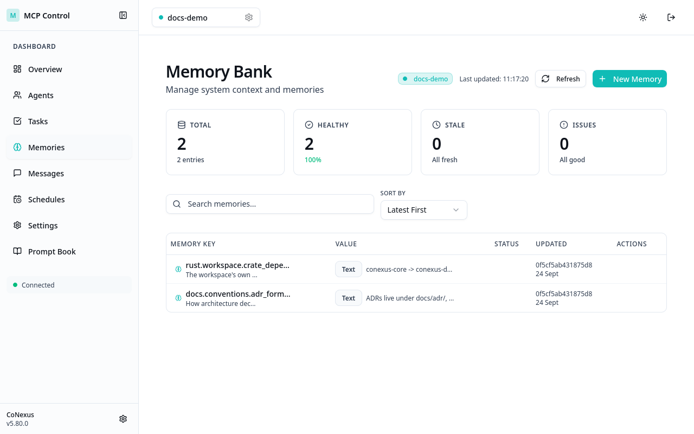
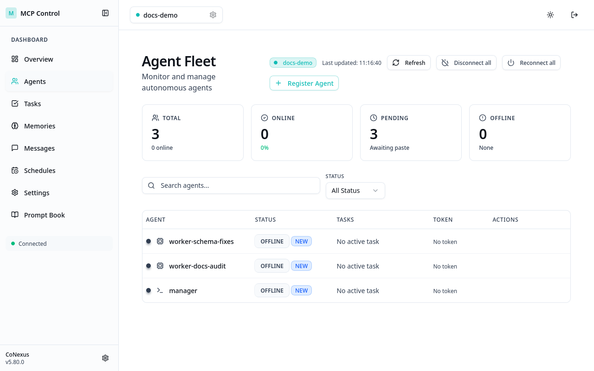
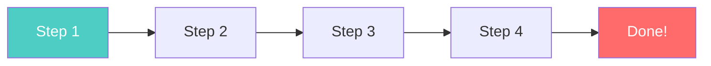
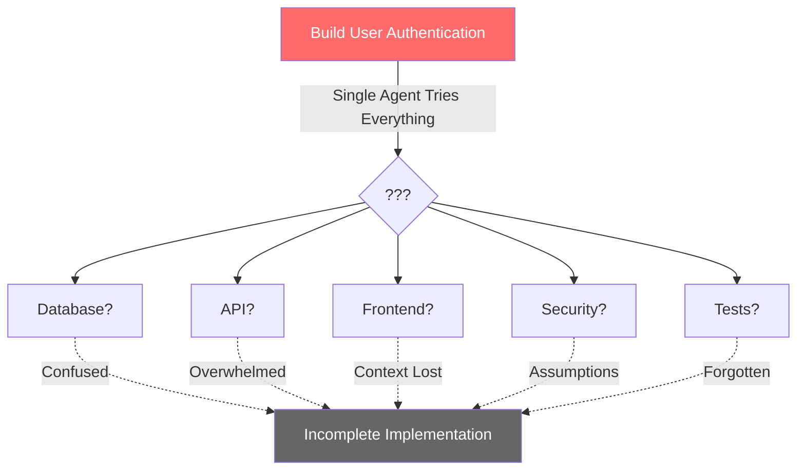
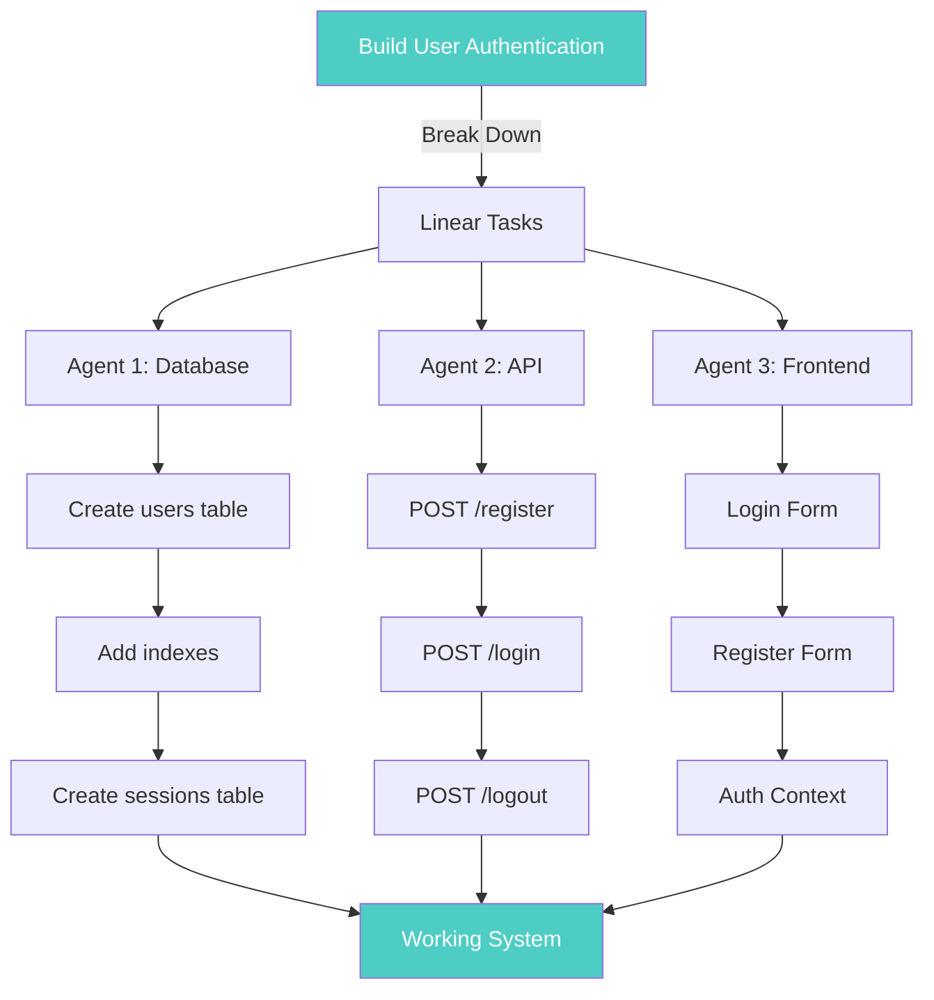

# CoNexus

> 🚀 **Advanced Tool Notice**: This framework is designed for experienced AI developers who need sophisticated multi-agent orchestration capabilities. CoNexus requires familiarity with AI coding workflows, MCP protocols, and distributed systems concepts. We're actively working to improve documentation and ease of use. If you're new to AI-assisted development, consider starting with simpler tools and returning when you need advanced multi-agent capabilities.

Multi-Agent Collaboration Protocol for coordinated AI software development.

<div align="center">
  
</div>

Think **Obsidian for your AI agents** - a living knowledge graph where multiple AI agents collaborate through shared context, intelligent task management, and real-time visualization. Watch your codebase evolve as specialized agents work in parallel, never losing context or stepping on each other's work.

## Why Multiple Agents?

Beyond the philosophical issues, traditional AI coding assistants hit practical limitations:
- **Context windows overflow** on large codebases
- **Knowledge gets lost** between conversations
- **Single-threaded execution** creates bottlenecks
- **No specialization** - one agent tries to do everything
- **Constant rework** from lost context and confusion

## The Multi-Agent Solution

CoNexus transforms AI development from a single assistant to a coordinated team:

### Core Capabilities

**Parallel Execution**  
Multiple specialized agents work simultaneously on different parts of your codebase. Backend agents handle APIs while frontend agents build UI components, all coordinated through shared memory.

**Persistent Knowledge Graph**  

<div align="center">
  
</div>

Your project's entire context lives in a searchable, persistent memory bank. Agents query this shared knowledge to understand requirements, architectural decisions, and implementation details. Nothing gets lost between sessions.

**Intelligent Task Management**  

<div align="center">
  
</div>

Monitor every agent's status, assigned tasks, and recent activity. The system automatically manages task dependencies, prevents conflicts, and ensures work flows smoothly from planning to implementation.

## Quick Start

This is a maintained fork ([dvaerum/CoNexus](https://github.com/dvaerum/CoNexus))
with a Rust backend/router (`rust/` — the original Python
implementation was retired once the rewrite reached functional
completeness); the dashboard (`conexus/dashboard/`) is Next.js/
TypeScript and unaffected by that. See
[`docs/operator/getting-started.md`](docs/operator/getting-started.md)
for the full install-to-first-project walkthrough (Nix build, project
registration, router startup, operator login) and
[`CONTRIBUTING.md`](CONTRIBUTING.md) for the dev/build/test loop.

```bash
git clone https://github.com/dvaerum/CoNexus.git
cd CoNexus

nix build .#conexus-backend .#conexus-router .#conexus-dashboard
```

### First-boot setup (operator login)

The dashboard requires operator login as of v5.0.59 (Phase 1 of the
operator-login plan; supersedes the legacy "anyone-with-the-URL"
admin assumption). On a fresh install, choose ONE of three bootstrap
paths:

1. **Setup wizard** — easiest for desktop use. Open the dashboard at
   `http://localhost:5454/conexus/` and you'll be redirected to
   `/conexus/setup`. Choose a username and password; that account
   becomes the first operator and inherits membership in every
   existing project.
2. **Env vars** — for declarative deployments (NixOS+sops, Docker
   Compose with a secrets file):

   ```bash
   export CONEXUS_BOOTSTRAP_USERNAME="dennis"
   export CONEXUS_BOOTSTRAP_PASSWORD="..."
   conexus-router --port 5454
   ```

   The router creates the first operator on startup and unsets the
   env vars in-process so the password doesn't leak into subprocess
   spawns.
3. **CLI** — `conexus-cli router create-operator --username
   alice` (prompts for password). Useful for adding subsequent
   operators after first boot.

After first boot, navigate to `http://localhost:5454/conexus/login`
to authenticate. The session cookie is HttpOnly + SameSite=Lax,
scoped to the deployment's mount prefix (`/conexus/` when
router-mounted, `/` single-tenant) — Secure only over HTTPS or with
`CONEXUS_REQUIRE_SECURE_COOKIES` set (plain-HTTP local dev, like the
`localhost` example above, gets no Secure flag). Agent-side MCP traffic
(`/conexus/mcp/<project>`) uses an `Authorization: Bearer
<agent_token>` header sourced from the `agents` table — agents don't
need to be aware of the operator login.

> **Note (2026-06-23):** the project-wide `admin_token` / `system_token`
> was fully retired in PRs #208 / #209 / #210 / #211 / Wave 5.
> External MCP clients (Claude Code, IDE plugins, ad-hoc scripts)
> authenticate with **per-agent bearer tokens** drawn from the
> `agents` table. See
> [docs/integrations/external-mcp-client.md](./docs/integrations/external-mcp-client.md) for
> the operator-facing migration guide.

## MCP Integration Guide

### What is MCP?

The **Model Context Protocol (MCP)** is an open standard that enables AI assistants to securely connect to external data sources and tools. CoNexus leverages MCP to provide seamless integration with various development tools and services.

### Running CoNexus as an MCP Server

CoNexus exposes its multi-agent surface as an MCP server.
External clients (Claude Code, Claude Desktop, Cline, IDE plugins,
ad-hoc scripts) authenticate with a per-agent bearer token
provisioned from the dashboard.

The full client-config story — endpoint shape, headers,
single-tenant vs router URL forms, how to provision the bearer,
and what to do when a token is lost — lives in
[`docs/integrations/external-mcp-client.md`](./docs/integrations/external-mcp-client.md).

The REST admin surface (`/conexus/api/<project>/…`) requires
an explicit version-pinned `Accept` header — see
[`docs/integrations/api-versioning.md`](./docs/integrations/api-versioning.md).

#### Tools at a glance

Once a manager agent is connected, these MCP tools are the most
common entry points. The dashboard's Tools tab is the canonical
inventory (descriptions and arg schemas are generated from
`rust/conexus-tools/src/*`).

**Agent management** — `register_agent` (mints a token + `.mcp.json`
snippet to paste into the user's own claude — conexus no longer
spawns claude itself, see "Worker agents" below), `list_agents`,
`terminate_agent` (revokes the token; does NOT stop the user's
claude process).

**Task orchestration** — `assign_task`, `view_tasks`, `update_task_status`.

**Knowledge management** — `ask_project_rag`, `update_project_context`, `view_project_context`.

**Communication** — `send_agent_message`, `broadcast_message`,
`request_assistance`.

#### Environment variables (most common)

```bash
# OpenAI / Ollama wiring (defaults to local Ollama when unset):
# export OPENAI_API_KEY="sk-..."                    # Switch to OpenAI cloud
# export OPENAI_BASE_URL="http://127.0.0.1:11434/v1"
# export OPENAI_MODEL="qwen3:1.7b"
# export CONEXUS_EMBEDDING_MODEL="qwen3-embedding:0.6b"
# export CONEXUS_EMBEDDING_DIMENSION="1024"
```

See [`docs/operator/getting-started.md`](./docs/operator/getting-started.md)
for the full reference (including `MCP_PROJECT_DIR` and the
bootstrap env vars `CONEXUS_BOOTSTRAP_USERNAME` /
`CONEXUS_BOOTSTRAP_PASSWORD`).

## How It Works: Breaking Complexity into Simple Steps



Every task can be broken down into linear steps. This is the core insight that makes CoNexus powerful.

### The Problem with Complex Tasks



### The CoNexus Solution



Each agent focuses on their linear chain. No confusion. No context pollution. Just clear, deterministic progress.

## The 5-Step Workflow

### 1. Provision a Manager Agent

Log into the dashboard, click **Register Agent** on the Agents page
and pick the `manager` role. The dashboard mints a bearer token and
hands you a ready-to-paste `.mcp.json` snippet. Paste it into your
AI client's MCP config and copy the bearer token into your manager
session prompt:

```
You are the manager agent.
Agent Token: "<your_manager_agent_token_from_the_dashboard>"

Your role is to:
- Coordinate all development work
- Create and manage worker agents
- Maintain project context
- Assign tasks based on agent specializations
```

The per-agent bearer is what authenticates you to the MCP server;
see [docs/integrations/external-mcp-client.md](./docs/integrations/external-mcp-client.md) for
the full external-client setup (client-config download, headers,
single-tenant vs router shapes).

### 2. Load Your Project Blueprint (MCD)
```
Add this MCD (Main Context Document) to project context:

[paste your MCD here - see docs/mcd-example/mcd-guide.md for structure]

Store every detail in the knowledge graph. This becomes the single source of truth for all agents.
```

The MCD (Main Context Document) is your project's comprehensive blueprint - think of it as writing the book of your application before building it. It includes:
- Technical architecture and design decisions
- Database schemas and API specifications
- UI component hierarchies and workflows
- Task breakdowns with clear dependencies

See our [MCD Guide](./docs/mcd-example/mcd-guide.md) for detailed examples and templates.

### 3. Register Your Agent Team

> **Wave 7 (2026-06-29): conexus is the coordinator, not the spawner.**
> conexus mints agent identities (DB row + bearer token) and gives
> the operator a ready-to-paste `.mcp.json` snippet. The user owns
> their own claude session — conexus never starts or stops
> claude processes. Terminate in the dashboard revokes the token;
> the user closes their own claude when they're done.

From the dashboard's **Agents** page, click **Register Agent** for
each specialized worker. Each registration returns a snippet shaped
like:

```json
{
  "mcpServers": {
    "conexus-<project>": {
      "type": "http",
      "url": "https://<host>/conexus/mcp/<project>",
      "headers": {"Authorization": "Bearer <agent_token>"}
    }
  }
}
```

Suggested specializations:

- `backend-worker` — API endpoints, database operations, business logic
- `frontend-worker` — UI components, state management, user interactions
- `integration-worker` — API connections, data flow, system integration
- `test-worker` — Unit tests, integration tests, validation
- `devops-worker` — Deployment, CI/CD, infrastructure

### 4. Start Your Workers Locally

Paste each agent's snippet into the **user's own `.mcp.json`** (one
per worker — `conexus-<project>` server keys are unique per
project, but the `name` field of each agent is part of the same
server entry so use one project's snippet at a time). Then start
claude in the project directory:

```
# In a new shell for each worker, after pasting the snippet into
# .mcp.json (project-scope) or ~/.claude.json (user-scope):
claude

# Then in claude:
You are [worker-name] agent.
Your Agent Token: "<worker_token_from_the_registration_snippet>"

Query the project knowledge graph to understand:
1. Overall system architecture
2. Your specific responsibilities
3. Integration points with other components
4. Coding standards and patterns to follow
5. Current implementation status

Begin implementation following the established patterns.

AUTO --worker --memory
```

Once a worker connects, the dashboard's agents list switches it from
"OFFLINE" (registered but never connected) to "ONLINE" — that's the
signal the worker's claude is wired up and the bearer is being
honoured by the MCP server.

**Important: Setting Agent Modes**

Agent modes (like `--worker`, `--memory`, `--playwright`) are not just flags - they activate specific behavioral patterns. In Claude Code, you can make these persistent by:

1. Copy the mode instructions to your clipboard
2. Type `#` to open Claude's memory feature
3. Paste the instructions for persistent behavior

Example for Claude Code memory:
```
# When I use "AUTO --worker --memory", follow these patterns:
- Always check file status before editing
- Query project RAG for context before implementing
- Document all changes in task notes
- Work on one file at a time, completing it before moving on
- Update task status after each completion
```

This ensures consistent behavior across your entire session without repeating instructions.

### 5. Monitor and Coordinate

The dashboard provides real-time visibility into your AI development team:

**Network Visualization** - Watch agents collaborate and share information  
**Task Progress** - Track completion across all parallel work streams  
**Memory Health** - Ensure context remains fresh and accessible  
**Activity Timeline** - See exactly what each agent is doing

Access at `http://localhost:5454/conexus/` after launching the router.

## Advanced Features

### Specialized Agent Modes

Agent modes fundamentally change how agents behave. They're not just configuration - they're behavioral contracts that ensure agents follow specific patterns optimized for their role.

**Standard Worker Mode**
```
AUTO --worker --memory
```
Optimized for implementation tasks:
- Granular file status checking before any edits
- Sequential task completion (one at a time)
- Automatic documentation of changes
- Integration with project RAG for context
- Task status updates after each completion

**Frontend Specialist Mode**
```
AUTO --worker --playwright
```
Enhanced with visual validation capabilities:
- All standard worker features
- Browser automation for component testing
- Screenshot capabilities for visual regression
- DOM interaction for end-to-end testing
- Component-by-component implementation with visual verification

**Research Mode**
```
AUTO --memory
```
Read-only access for analysis and planning:
- No file modifications allowed
- Deep context exploration via RAG
- Pattern identification across codebase
- Documentation generation
- Architecture analysis and recommendations

**Memory Management Mode**
```
AUTO --memory --manager
```
For context curation and optimization:
- Memory health monitoring
- Stale context identification
- Knowledge graph optimization
- Context summarization for new agents
- Cross-agent knowledge transfer

Each mode enforces specific behaviors that prevent common mistakes and ensure consistent, high-quality output.

### Project Memory Management

The system maintains several types of memory:

**Project Context** - Architectural decisions, design patterns, conventions  
**Task Memory** - Current status, blockers, implementation notes  
**Agent Memory** - Individual agent learnings and specializations  
**Integration Points** - How different components connect

All memory is:
- Searchable via semantic queries
- Version controlled for rollback
- Tagged for easy categorization
- Automatically garbage collected when stale

### Conflict Resolution

File-level locking prevents agents from overwriting each other's work:

1. Agent requests file access
2. System checks if file is locked
3. If locked, agent works on other tasks or waits
4. After completion, lock is released
5. Other agents can now modify the file

This happens automatically - no manual coordination needed.

## Short-Lived vs. Long-Lived Agents: The Critical Difference

### Traditional Long-Lived Agents
Most AI coding assistants maintain conversations across entire projects:
- **Accumulated context grows unbounded** - mixing unrelated code, decisions, and conversations
- **Confused priorities** - yesterday's bug fix mingles with today's feature request
- **Hallucination risks increase** - agents invent connections between unrelated parts
- **Performance degrades over time** - every response processes irrelevant history
- **Security vulnerability** - one carefully crafted prompt could expose your entire project

### CoNexus's Ephemeral Agents
Each agent is purpose-built for a single task:
- **Minimal, focused context** - only what's needed for the specific task
- **Crystal clear objectives** - one task, one goal, no ambiguity
- **Deterministic behavior** - limited context means predictable outputs
- **Consistently fast responses** - no context bloat to slow things down
- **Secure by design** - agents literally cannot access what they don't need

### A Practical Example

**Traditional Approach**: "Update the user authentication system"
```
Agent: I'll update your auth system. I see from our previous conversation about 
database migrations, UI components, API endpoints, deployment scripts, and that 
bug in the payment system... wait, which auth approach did we decide on? Let me 
try to piece this together from our 50+ message history...

[Agent produces confused implementation mixing multiple patterns]
```

**CoNexus Approach**: Same request, broken into focused tasks
```
Agent 1 (Database): Create auth tables with exactly these fields...
Agent 2 (API): Implement /auth endpoints following REST patterns...
Agent 3 (Frontend): Build login forms using existing component library...
Agent 4 (Tests): Write auth tests covering these specific scenarios...
Agent 5 (Integration): Connect components following documented interfaces...

[Each agent completes their specific task without confusion]
```

## The Theory Behind Linear Decomposition

### The Philosophy: Short-Lived Agents, Granular Tasks

Most AI development approaches suffer from a fundamental flaw: they try to maintain massive context windows with a single, long-running agent. This leads to:

- **Context pollution** - Irrelevant information drowns out what matters
- **Hallucination risks** - Agents invent connections between unrelated parts
- **Security vulnerabilities** - Agents with full context can be manipulated
- **Performance degradation** - Large contexts slow down reasoning
- **Unpredictable behavior** - Too much context creates chaos

### Our Solution: Ephemeral Agents with Shared Memory

CoNexus implements a radically different approach:

**Short-Lived, Focused Agents**  
Each agent lives only as long as their specific task. They:
- Start with minimal context (just what they need)
- Execute granular, linear tasks with clear boundaries
- Document their work in shared memory
- Terminate upon completion

**Shared Knowledge Graph (RAG)**  
Instead of cramming everything into context windows:
- Persistent memory stores all project knowledge
- Agents query only what's relevant to their task
- Knowledge accumulates without overwhelming any single agent
- Clear separation between working memory and reference material

**Result**: Agents that are fast, focused, and safe. They can't be manipulated to reveal full project details because they never have access to it all at once.

### Why This Matters for Safety

Traditional long-context agents are like giving someone your entire codebase, documentation, and secrets in one conversation. Our approach is like having specialized contractors who only see the blueprint for their specific room.

- **Reduced attack surface** - Agents can't leak what they don't know
- **Deterministic behavior** - Limited context means predictable outputs
- **Audit trails** - Every agent action is logged and traceable
- **Rollback capability** - Mistakes are isolated to specific tasks

### The Fundamental Principle

**Any task that cannot be expressed as `Step 1 → Step 2 → Step N` is not atomic enough.**

This principle drives everything in CoNexus:

1. **Complex goals** must decompose into **linear sequences**
2. **Linear sequences** can execute **in parallel** when independent
3. **Each step** must have **clear prerequisites** and **deterministic outputs**
4. **Integration points** are **explicit** and **well-defined**

### Why Linear Decomposition Works

**Traditional Approach**: "Build a user authentication system"
- Vague requirements lead to varied implementations
- Agents make different assumptions
- Integration becomes a nightmare

**CoNexus Approach**: 
```
Chain 1: Database Layer
  1.1: Create users table with id, email, password_hash
  1.2: Add unique index on email
  1.3: Create sessions table with user_id, token, expiry
  1.4: Write migration scripts
  
Chain 2: API Layer  
  2.1: Implement POST /auth/register endpoint
  2.2: Implement POST /auth/login endpoint
  2.3: Implement POST /auth/logout endpoint
  2.4: Add JWT token generation
  
Chain 3: Frontend Layer
  3.1: Create AuthContext provider
  3.2: Build LoginForm component
  3.3: Build RegisterForm component
  3.4: Implement protected routes
```

Each step is atomic, testable, and has zero ambiguity. Multiple agents can work these chains in parallel without conflict.

## Why Developers Choose CoNexus

**The Power of Parallel Development**  
Instead of waiting for one agent to finish the backend before starting the frontend, deploy specialized agents to work simultaneously. Your development speed is limited only by how well you decompose tasks.

**No More Lost Context**  
Every decision, implementation detail, and architectural choice is stored in the shared knowledge graph. New agents instantly understand the project state without reading through lengthy conversation histories.

**Predictable, Reliable Outputs**  
Focused agents with limited context produce consistent results. The same task produces the same quality output every time, making development predictable and testable.

**Built-in Conflict Prevention**  
File-level locking and task assignment prevent agents from stepping on each other's work. No more merge conflicts from simultaneous edits.

**Complete Development Transparency**  
Watch your AI team work in real-time through the dashboard. Every action is logged, every decision traceable. It's like having a live view into your development pipeline.

**For Different Team Sizes**

**Solo Developers**: Transform one AI assistant into a coordinated team. Work on multiple features simultaneously without losing track.

**Small Teams**: Augment human developers with AI specialists that maintain perfect context across sessions.

**Large Projects**: Handle complex systems where no single agent could hold all the context. The shared memory scales infinitely.

**Learning & Teaching**: Perfect for understanding software architecture. Watch how tasks decompose and integrate in real-time.

## System Requirements

- **Rust**: stable toolchain (backend/router, `rust/`)
- **Node.js**: 22.0.0+ (dashboard, recommended: 22.16.0)
- **npm**: 9.0.0+ (recommended: 10.9.2)
- **Nix** with flakes enabled (the real deployment path; also the
  easiest way to build the Rust binaries + dashboard together)
- **OpenAI API key**, or the bundled local Ollama default (for
  embeddings and RAG)
- **RAM**: 4GB minimum
- **AI coding assistant**: Claude Code or Cursor

For consistent development environment:
```bash
# Using nvm (Node Version Manager) — the .nvmrc lives in the
# dashboard directory, so cd there first
(cd conexus/dashboard && nvm use)  # Automatically uses Node v22.16.0 from .nvmrc

# Or manually check versions
node --version    # Should be >=22.0.0
npm --version     # Should be >=9.0.0
rustc --version   # stable toolchain
```

## Troubleshooting

**"Admin token not found"**
The project-wide admin token was retired in PRs #208–#211.
Provision a per-agent bearer from the dashboard instead — see
[docs/integrations/external-mcp-client.md](./docs/integrations/external-mcp-client.md).

**"Worker can't access tasks"**
Ensure you're initializing each worker with its own per-agent
token from the dashboard's `agents` table — not a shared token.

**"Agents overwriting each other"**  
Verify all workers are initialized with the `--worker` flag for proper coordination.

**"Dashboard connection failed"**  
1. Ensure MCP server is running first
2. Check Node.js version (22+ required)
3. Reinstall dashboard dependencies

**"Memory queries returning stale data"**  
Restart the affected project's backend (`systemctl --user restart conexus@<project>`) to force a fresh read.

## Documentation

The `docs/` tree is organised by audience. Start at
[`docs/README.md`](./docs/README.md) for the full index, or jump
straight to the most common entry points:

- [Operator setup](./docs/operator/getting-started.md) — install, first-boot, env vars, your first multi-agent project
- [Connecting external MCP clients](./docs/integrations/external-mcp-client.md) — per-agent bearer tokens for Claude Code / IDE plugins / scripts (post-`system_token` retirement)
- [REST API versioning](./docs/integrations/api-versioning.md) — required `Accept` header and the version negotiation contract
- [MCD Creation Guide](./docs/mcd-example/mcd-guide.md) — write effective project blueprints
- [Architecture decisions (ADRs)](./docs/adr/) — operator-login, single-tenant URL parity, event-driven coordination, SSO, etc.
- [Theoretical foundation](./docs/theory/) — chapters on cognitive empathy, context, tools, and intelligent judgement

## Community and Support

**Get Help**
- [GitHub Issues](https://github.com/dvaerum/CoNexus/issues) - Bug reports and features (this fork; see [CONTRIBUTING.md](CONTRIBUTING.md) for the upstream/fork split)
- [Discussions](https://github.com/dvaerum/CoNexus/discussions) - Share your experiences

**Contributing**
We welcome contributions! See our [Contributing Guide](CONTRIBUTING.md) for:
- Code style and standards
- Testing requirements
- Pull request process
- Development setup

## License

[](https://www.gnu.org/licenses/agpl-3.0)

This project is licensed under the **GNU Affero General Public License v3.0 (AGPL-3.0)**.

**What this means:**
- ✅ You can use, modify, and distribute this software
- ✅ You can use it for commercial purposes
- ⚠️ **Important**: If you run a modified version on a server that users interact with over a network, you **must** provide the source code to those users
- ⚠️ Any derivative works must also be licensed under AGPL-3.0
- ⚠️ You must include copyright notices and license information

See the [LICENSE](LICENSE) file for complete terms and conditions.

**Why AGPL?** We chose AGPL to ensure that improvements to CoNexus benefit the entire community, even when used in server/SaaS deployments. This prevents proprietary forks that don't contribute back to the ecosystem.

---

Built by developers who believe AI collaboration should be as sophisticated as human collaboration.
