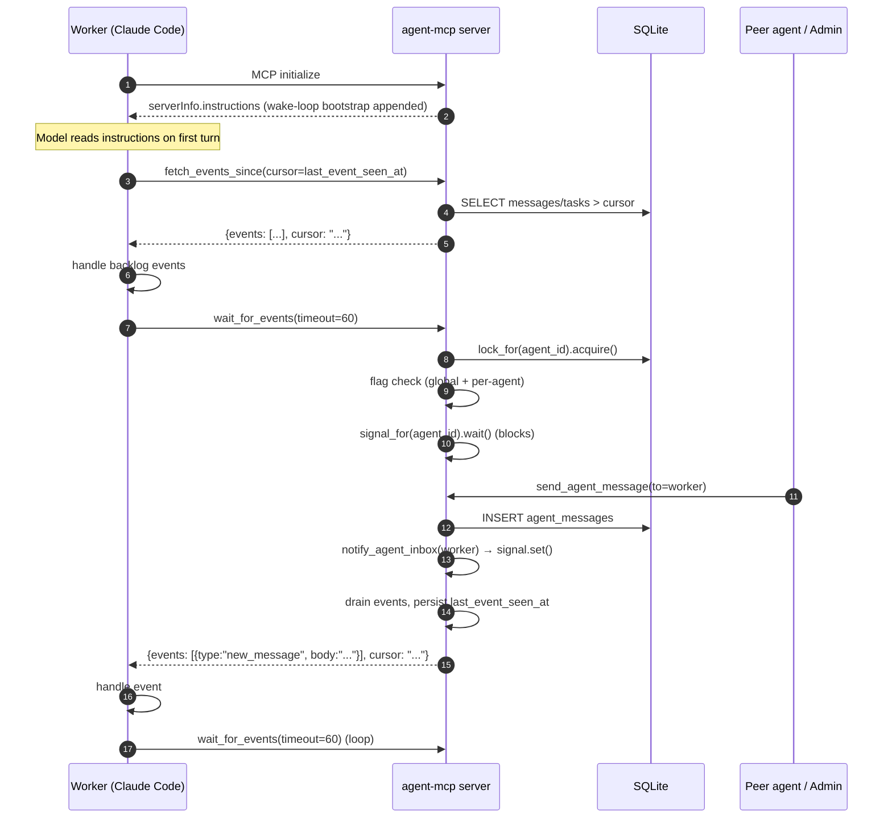
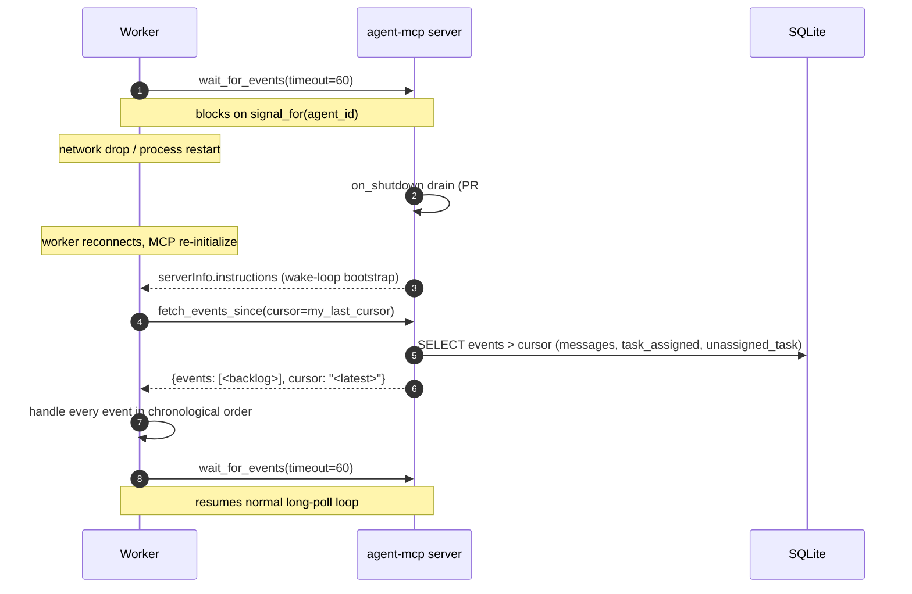
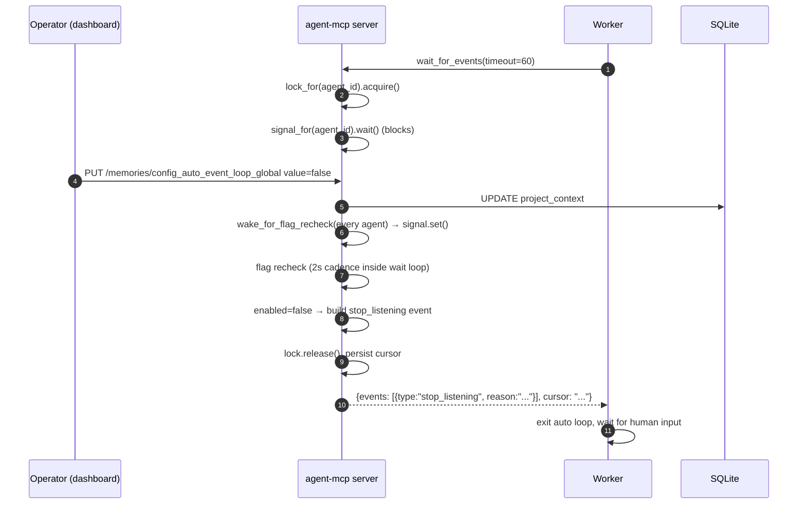

# ADR-0011: Event-driven worker-agent coordination via long-poll `wait_for_events`

## Status

Accepted (2026-06-05).

## Context

Worker agents (`backend-dev`, `ios-app-dev`, the daemon-agent family —
long-running Claude Code sessions connected over MCP) historically sit
idle between human prompts. There has been no mechanism for the server
to wake an agent when a message lands in its inbox, a task is assigned
to it, or an unassigned task it could claim appears. Every coordination
loop has required a human to type a turn-trigger.

A surprise from the codebase audit that preceded this ADR: the
long-poll infrastructure was already partly in place but unused by
the workers Dennis runs in production.
`agent_mcp/core/globals.py` exposes `signal_for(agent_id)` (per-agent
`asyncio.Event`) and `notify_agent_inbox(agent_id)`, and the latter is
called from every mutator (`assign_task`, `send_agent_message`,
`update_task_status`, broadcast) post-commit. The streaming-transport
session registry maintains per-session runtime queues via
`fanout_to_agent`. What was missing was the wake-loop bootstrap (so
freshly-connected workers actually call `wait_for_events`), capability-
routed fan-out for unassigned tasks, the cursor model for
disconnect-and-recover, and operator-visible toggles + telemetry.

This ADR documents the architecture shipped in PRs #126, #127 and #128
and the dashboard polish shipped alongside this ADR in PR-3.

## Decision

| Decision | Choice |
|--|--|
| Worker model | Always-alive Claude Code session |
| Wake mechanism | Long-poll on server, **60s default** timeout, configurable via `AGENT_MCP_EVENT_WAIT_TIMEOUT` (max 300s) |
| Events in MVP | (a) `new_message`, (b) `task_assigned`, (c) `unassigned_task_appeared` |
| Capability matching | **Subset**: agent matches if `agent.capabilities ⊇ task.required_capabilities`. Lowercase-normalised free-text labels. Empty `required_capabilities` ⇒ wake everyone. Empty `agent.capabilities` ⇒ match only empty-required tasks. |
| Wake-loop kickoff | `serverInfo.instructions` primary + MCP prompt (`event-loop`) fallback |
| Global toggle | Dashboard Settings (`project_context.config_auto_event_loop_global`, default TRUE) |
| Per-agent toggle | `agents.auto_event_loop BOOLEAN NOT NULL DEFAULT 1`. Greyed out (with note) in the per-agent edit modal when global is OFF. |
| Stop notification | Flows through `wait_for_events` return as `{type: "stop_listening", reason: "..."}` |
| Reconnect catch-up | Push+pull: `agents.last_event_seen_at TEXT NULL` (ISO cursor) + `fetch_events_since(cursor)` tool. Wake-loop instructions cover both session-start and reconnect catch-up. |
| Event payload | Hybrid: **fat** for `new_message` + `task_assigned`; **skinny** for `unassigned_task_appeared` (title + priority + required_capabilities only; agent calls `view_tasks` for full body) |
| Concurrent `wait_for_events` per agent | Reject second with HTTP 409 analog (`{"error": "another_wait_in_flight"}`) via per-agent `asyncio.Lock` (`g.lock_for(agent_id)`) |
| Shutdown drain | Already shipped (PR #125 v5.0.8 — `on_shutdown` cancels in-flight waits cleanly) |

## Sequence diagrams

### Happy path

### Reconnect catch-up

### Stop-listening on toggle flip

## Non-goal: MCP push does not wake the model

The MCP spec's
`notifications/tools/list_changed`,
`notifications/resources/updated` and
`notifications/message` frames update **client-side state**. They are
only observed by the model on its **next turn** — which only happens
if the model is already running (mid-tool-call, or invoked by an
external scheduler). They do not wake an idle Claude Code session.

The long-poll wake loop is the only spec-compliant mechanism that
bridges "model is asleep" → "server has news." This ADR explicitly
locks that distinction so future spec changes (e.g. a hypothetical
server-initiated `wake` frame) trigger an ADR amendment rather than a
silent design pivot.

## Alternatives considered

- **Pure periodic polling.** Each idle hour costs roughly 90k tokens
  (a `get_agent_messages` call every ~40s plus the model's framing tokens)
  versus roughly 12k with 60s long-poll waits. Long-poll also
  delivers messages within the wake latency (~ms after `signal.set()`)
  instead of one polling interval. Rejected on cost and latency.

- **MCP push to wake the model.** The MCP transport cannot wake an
  idle Claude Code session — notifications only update client-side
  caches (see non-goal above). Rejected as a spec-impossibility.

- **Sidecar daemon → external notification (Slack / pager / tmux
  ping).** Defers the wake from the agent to a human operator. Does
  not solve autonomous coordination — every chain still has a human
  in the loop. Useful as a redundancy channel (the existing AoE
  notifier shipped in PR #98 already covers this niche), but not as
  the primary wake mechanism. Rejected as the primary; retained as
  the redundancy channel.

## Consequences

Positive:

- Workers coordinate autonomously — assigning a task or sending a
  message wakes the recipient within milliseconds without human
  involvement.
- Low idle token cost (~12k tokens/hour at the default 60s timeout)
  compared to periodic polling.
- The catch-up cursor (`agents.last_event_seen_at` +
  `fetch_events_since`) means transient network drops or process
  restarts don't silently lose events — the next reconnect drains
  backlog deterministically.
- Operators retain full control via two orthogonal toggles
  (global + per-agent), and can verify activity at a glance via the
  PR-3 "WAITING" chip + "X agents currently in wait" Settings count.
- The capability-routed wake means an `unassigned_task_appeared` only
  pings agents that can plausibly claim the task — backend tasks
  don't wake the ios-app-dev worker, and vice versa.

Risks and limits:

- **Single-session-per-agent constraint.** Concurrent
  `wait_for_events` calls for the same agent return HTTP 409. This is
  intentional (multi-session-per-agent has no MVP use case), but
  legitimate scenarios may emerge later (e.g. an agent with multiple
  capability profiles); revisit if a real case appears.
- **Capability matching is O(N) in Python.** For each unassigned-task
  create, every agent's `capabilities` set is loaded and subset-
  matched in-process. Fine for the < 100-agent deployments seen so
  far; switch to SQL-indexed matching when an installation crosses
  that threshold.
- **ISO-timestamp cursor.** The cursor reuses
  `agent_actions.timestamp` / created_at conventions with
  millisecond resolution. At sub-100-event/sec scale (any current
  installation) this is sufficient; faster event firehoses would need
  a monotonic per-agent counter.

VM test scaffold (`nix/tests/event-driven-coord.nix`) is committed but
the cache-refresh case is left as a follow-up — Python harness tests
cover all spec behaviours in-process.

## Links

- Plan: the "prancy-napping-pie" working plan — an ephemeral Claude
  Code plan-mode file, never committed to this repo, no longer
  available. This ADR is the durable record.
- PR #126 — schema + capability routing groundwork (v5.0.9)
- PR #127 — required_capabilities dashboard chip fix (v5.0.10)
- PR #128 — `wait_for_events` hardening + capability-routed wake + cursor (v5.0.11)
- PR-3 (this ADR) — dashboard waiting chip + Settings page count
